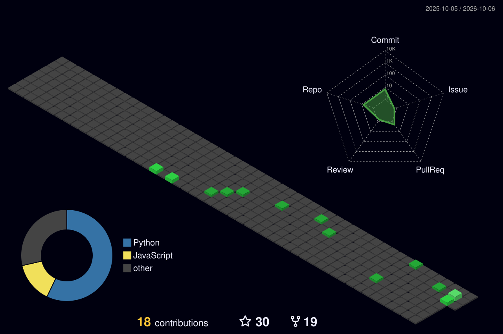

  

  
  
  

  

 

### Doctreen

AI Research Intern, then AI Engineer (01/2025 to 05/2026), on a medical report-generation platform.

- Integrated LLMs from OpenAI, Nebius and OVH with prompt engineering and RAG, served through FastAPI.
- Designed vision analysis pipelines for DICOM imaging across 10+ modalities, benchmarked against radiologist-derived ground truth.
- Built a multi-model benchmarking system that evaluates LLMs across every pipeline stage in parallel.
- Implemented guardrails and input validation against prompt injection and adversarial inputs.
- Built internal tooling, including a token-efficient serialisation format.
- Served as acting Product Manager: market research, user feedback, and PRDs.

### Research

Currently working on **foundation models in the biomedical space**, alongside agentic AI, memory, multi-agent systems and LLM architecture.

**SPARE: Single-view Parameter-efficient Adapter for Radiology Reporting** (Springer, PCCDA 2026) 
Connects the RAD-DINO vision encoder to BioGPT through a Semantic Alignment Adapter, built for single frontal chest X-rays. LoRA cuts trainable parameters by 98% so it fits consumer GPUs. It reaches a BERTScore F1 of 79.0% on MIMIC-CXR using 0.8% of the training corpus, retaining 93.6% of state-of-the-art performance.

### Projects

<table>
  <tr>
    <td width="50%" valign="top">
      <b>VidyaPath</b> 
      Multi-school LMS for CBSE Class 10 and 12, with portals for teachers, admins, students and parents. Groq and Gemini routing for AI-assisted assignment and question bank generation. 
      <code>Next.js 14</code> <code>Supabase</code> <code>RAG</code>
    </td>
    <td width="50%" valign="top">
      <b>LensAI</b> 
      Browser extension: highlight code, diagrams, articles or UI and get a structured explanation without leaving the tab. 
      <code>JavaScript</code> <code>Extension APIs</code> <code>LLM</code>
    </td>
  </tr>
  <tr>
    <td valign="top">
      <b>Namude Yatra</b> 
      Multi-agent travel planner that builds day-by-day itineraries, with map views and a chatbot for trip changes. 
      <code>LangChain</code> <code>Streamlit</code> <code>Pydeck</code>
    </td>
    <td valign="top">
      <b>OptiHire</b> 
      Generates tailored cover letters and emails from job descriptions, flags resume keyword gaps, and tracks applications. 
      <code>Streamlit</code> <code>NLP</code> <code>Web scraping</code>
    </td>
  </tr>
</table>

**CodrantLabs**, the product and AI engineering studio I co-founded, builds web platforms, AI agents, RAG systems and search visibility systems for service businesses and startups, from Kerala.

### Community

- **ACM Student Chapter, Amritapuri:** Chairperson for 1.5 years, grew the community to 200+ members, ran national-level hackathons and mentored juniors in ML. Now on the Advisory Council.
- **ICPC Asia West Regional Finals:** Overall Coordinator (2022 to 2023).
- **Resource person** at the LBSITW ACM-W chapter launch, Trivandrum (2026).

### Toolbox

  

  
  
  
  
  
  

### Activity

  <picture>
    <source media="(prefers-color-scheme: dark)" srcset="./profile-3d-contrib/profile-night-green.svg" />
    <source media="(prefers-color-scheme: light)" srcset="./profile-3d-contrib/profile-green-animate.svg" />
    
  </picture>

  
  

  

  <picture>
    <source media="(prefers-color-scheme: dark)" srcset="https://raw.githubusercontent.com/ADITHYASNAIR2021/ADITHYASNAIR2021/output/github-snake-dark.svg" />
    <source media="(prefers-color-scheme: light)" srcset="https://raw.githubusercontent.com/ADITHYASNAIR2021/ADITHYASNAIR2021/output/github-snake.svg" />
    
  </picture>

  

  

